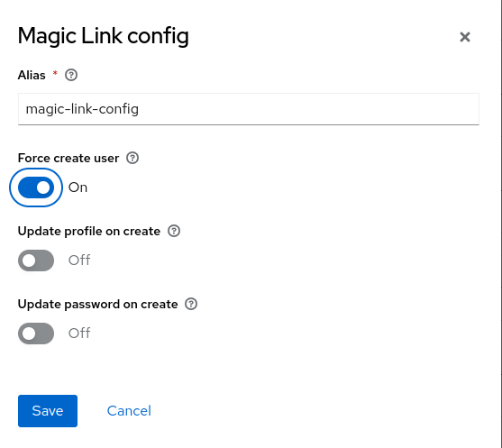
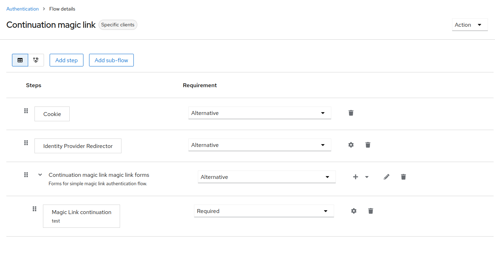
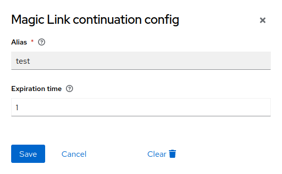
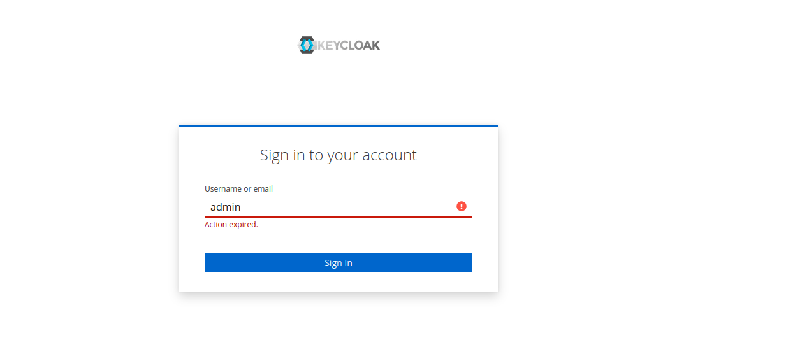
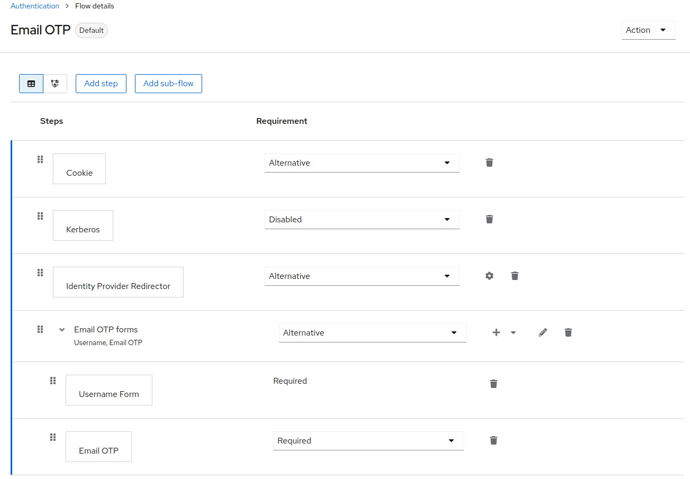

> :rocket: **Try it for free** in the new Phase Two [keycloak managed service](https://phasetwo.io/?utm_source=github&utm_medium=readme&utm_campaign=keycloak-magic-link). See the [announcement and demo video](https://phasetwo.io/blog/self-service/) for more information.

# keycloak-magic-link

Magic link implementation. Inspired by the [experiment](https://github.com/stianst/keycloak-experimental/tree/main/magic-link) by [@stianst](https://github.com/stianst).
It comes in two types: magic link and magic link continuation;

There is also a simple Email OTP authenticator implementation here.
This extension is used in the [Phase Two](https://phasetwo.io) cloud offering, and is released here as part of its commitment to making its [core extensions](https://phasetwo.io/docs/introduction/open-source) open source. Please consult the [license](COPYING) for information regarding use.

## Quick start

The easiest way to get started is our [Docker image](https://quay.io/repository/phasetwo/phasetwo-keycloak?tab=tags). Documentation and examples for using it are in the [phasetwo-containers](https://github.com/p2-inc/phasetwo-containers) repo. The most recent version of this extension is included.

## Magic link

This implementation differs from the original in that it creates an ActionToken that is sent as the link. This is convenient, as it does not require the user to click on the link from the same device. A common use case we heard was users entering their email address on the desktop, but then clicking on the link on their mobile, so we wanted to solve for that case.

This contains two pathways to get a Magic Link:

### Authenticator

An Authenticator that can run as a form in your login flow. This takes an email, and can optionally create a user if none exists. This implementation sends the email using a theme-resources template, which you can override. Installation can be achieved by duplicating the Browser flow, and replacing the normal Username/Password/OTP forms with the Magic Link execution type ([@tstec-polypoly](https://github.com/tstec-polypoly) provides a great step-by-step guide for setting it up https://github.com/p2-inc/keycloak-magic-link/issues/6#issuecomment-1230675741). Note that you aren't required to use a _Username form_ with this, as it extends `UsernamePasswordForm` and renders the username form page for you:


The authenticator can be configured to create a user with the given email address as username/email if none exists. It is also possible to force `UPDATE_PROFILE` and `UPDATE_PASSWORD` required actions when the user is created by this Authenticator:



## Magic link continuation

This Magic link continuation authenticator is similar to the Magic Link authenticator in implementation, but has a different behavior. Instead of creating a session on the device where the link is clicked, the flow continues the login on the initial login page. The login page is polling the authentication page each 5 seconds until the session is confirmed or the authentication flow expires. The default expiration for the Magic link continuation flow is 10 minutes.

### Authenticator



The authenticator can be configured to set the expiration of the authentication flow.



When the period is exceeded the authentication flow will reset.



### Resource

A Resource you can call with `manage-users` role, which allows you to specify the email, clientId, redirectUri, tokenExpiry and optionally if the email is sent, or the link is just returned to the caller.

Parameters:
| Name | Required | Default | Description |
| ----- | ----- | ----- | ----- |
| `email` | Y | | Email address associated with the User to create the magic link for. |
| `username` | N | | Username of the User to create the magic link for. Ignores email and forces `force_create`, `update_profile`, `update_password` and `send_email` to `false` if set. |
| `client_id` | Y | | Client ID the user will be logging in to. |
| `redirect_uri` | Y | | Redirect URI. Must be valid for the given client. |
| `expiration_seconds` | N | 86400 (1 day) | Amount of time the magic link is valid. |
| `force_create` | N | false | Create a user with this email address as username/email if none exists. |
| `update_profile` | N | false | Add an UPDATE_PROFILE required action if the user was created. |
| `update_password` | N | false | Add an UPDATE_PASSWORD required action if the user was created. |
| `send_email` | N | false | Send the magic link email using the built in template. |
| `scope` | N | | OIDC `scope` variable. |
| `nonce` | N | | OIDC `nonce` variable. |
| `state` | N | | OIDC `state` variable. |
| `code_challenge` | N | | OIDC `code_challenge` variable (for PKCE). |
| `remember_me` | N | false | If the user is treated as if they had checked "Remember Me" on login. Requires that it is enabled in the Realm. |
| `reusable` | N | true | If the token can be reused multiple times during its validity |

Sample request (replace your access token):

```
curl --request POST https://keycloak.host/auth/realms/test/magic-link \
 --header "Accept: application/json" \
 --header "Content-Type: application/json" \
 --header "Authorization: Bearer <access_token>" \
 --data '{"email":"foo@foo.com","client_id":"account-console","redirect_uri":"https://keycloak.host/auth/realms/test/account/","expiration_seconds":3600,"force_create":true,"update_profile":true,"update_password":true,"send_email":false}'
```

Sample response:

```
{
  "user_id": "386edecf-3e43-41fd-886c-c674eea41034",
  "link": "https://keycloak.host/auth/realms/test/login-actions/action-token?key=eyJhbG...KWuDyE&client_id=account-console",
  "sent": false
}
```

## Email OTP

There is a simple authenticator to email a 6-digit OTP to the users email address. This implementation sends the email using a theme-resources template, which you can override. It is recommended to use this in an Authentication flow following the _Username form_. An example flow looks like this:


## Installation

1. Build the jar:

```
mvn clean install
```

2. Copy the jar produced in `target/` to your `providers` directory (for Quarkus) or `standalone/deployments` directory (for legacy) and rebuild/restart keycloak.

## Releases

Releases are tagged and published to [Maven Central](https://repo1.maven.org/maven2/io/phasetwo/keycloak/keycloak-magic-link/) after each merge to `main`. Jars can be downloaded from there.

If you are depending on the library in your own Maven-built project, or using a bundling tool in Maven, you can add the dependency like this:

```xml
    <dependency>
      <groupId>io.phasetwo.keycloak</groupId>
      <artifactId>keycloak-magic-link</artifactId>
      <version>VERSION</version>
    </dependency>
```

## Implementation Notes

This is a rough outline of the implementation:

- Given an email address
  - see if the email is already associated with a user
    - if yes, use that one
    - if not, create a user (this is configurable)
  - check to see if the redirectUri is valid for the client
    - if yes, continue
    - if not, throw an error
  - create an action token that encodes the user, expiry, clientId and redirectUri
  - action token handler needs to
    - invalidate the action token after single use
    - set the redirectUri
    - make sure to continue the login session after the handler

## Demo

User contributed POC using Jupyter: https://github.com/tstec-polypoly/explore-keycloak

---

All documentation, source code and other files in this repository are Copyright 2024 Phase Two, Inc.
