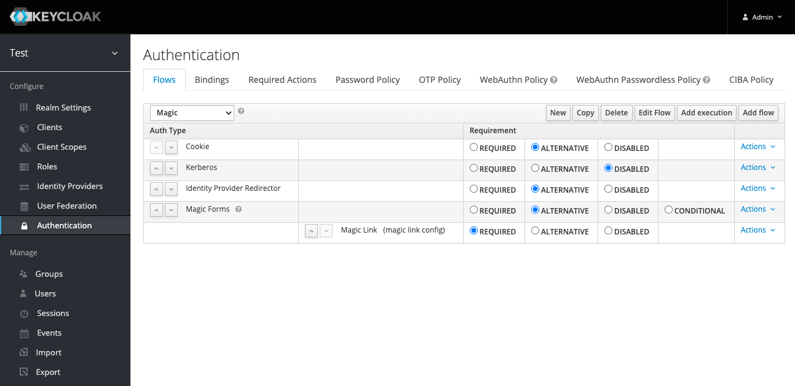

> :rocket: **Try it for free** in the new Phase Two [keycloak managed service](https://phasetwo.io/dashboard/?utm_source=github&utm_medium=readme&utm_campaign=keycloak-magic-link). See the [announcement and demo video](https://phasetwo.io/blog/self-service/) for more information.

# keycloak-magic-link

Magic link implementation. Inspired by the [experiment](https://github.com/stianst/keycloak-experimental/tree/main/magic-link) by [@stianst](https://github.com/stianst).

This extension is used in the [Phase Two](https://phasetwo.io) cloud offering, and is released here as part of its commitment to making its [core extensions](https://phasetwo.io/docs/introduction/open-source) open source. Please consult the [license](COPYING) for information regarding use.

## Quick start

The easiest way to get started is our [Docker image](https://quay.io/repository/phasetwo/phasetwo-keycloak?tab=tags). Documentation and examples for using it are in the [phasetwo-containers](https://github.com/p2-inc/phasetwo-containers) repo. The most recent version of this extension is included.

## Overview

This implementation differs from the original in that it creates an ActionToken that is sent as the link. This is convenient, as it does not require the user to click on the link from the same device. A common use case we heard was users entering their email address on the desktop, but then clicking on the link on their mobile, so we wanted to solve for that case.

This contains two pathways to get an Magic Link:

1. An Authenticator that can run as a form in your login flow. This takes an email, and can optionally create a user if none exists. This implementation sends the email using a theme-resources template, which you can override. Installation can be achieved by duplicating the Browser flow, and replacing the normal Username/Password/OTP forms with the Magic Link execution type ([@tstec-polypoly](https://github.com/tstec-polypoly) provides a great step-by-step guide for setting it up https://github.com/p2-inc/keycloak-magic-link/issues/6#issuecomment-1230675741):

2. A Resource you can call with `manage-users` role, which allows you to specify the email, clientId, redirectUri, tokenExpiry and optionally if the email is sent, or the link is just returned to the caller.

Parameters:
| Name | Required | Default | Description |
| ----- | ----- | ----- | ----- |
| `email` | Y | | Email address associated with the User to create the magic link for. |
| `username` | N | | Username of the User to create the magic link for. Ignores email and forces `force_create`, `update_profile`, and `send_email` to `false` if set. |
| `client_id` | Y | | Client ID the user will be logging in to. |
| `redirect_uri` | Y | | Redirect URI. Must be valid for the given client. |
| `expiration_seconds` | N | 86400 (1 day) | Amount of time the magic link is valid. |
| `force_create` | N | false | Create a user with this email address as username/email if none exists. |
| `update_profile` | N | false | Add an UPDATE_PROFILE required action if the user was created. |
| `send_email` | N | false | Send the magic link email using the built in template. |

Sample request (replace your access token):
```
curl --request POST https://keycloak.host/auth/realms/test/magic-link \
 --header "Accept: application/json" \
 --header "Content-Type: application/json" \
 --header "Authorization: Bearer <access_token>" \
 --data '{"email":"foo@foo.com","client_id":"account-console","redirect_uri":"https://keycloak.host/auth/realms/test/account/","expiration_seconds":3600,"force_create":true,"update_profile":true,"send_email":false}'
```
Sample response:
```
{
  "user_id": "386edecf-3e43-41fd-886c-c674eea41034",
  "link": "https://keycloak.host/auth/realms/test/login-actions/action-token?key=eyJhbG...KWuDyE&client_id=account-console",
  "sent": false
}
```

## Installation

1. Build the jar:
```
mvn clean install
```

2. Copy the jar produced in `target/` to your `providers` directory (for Quarkus) or `standalone/deployments` directory (for legacy) and rebuild/restart keycloak.

## Implementation Notes

This is a rough outline of the implementation:

- Given an email address
  - see if the email is already associated with a user
    - if yes, use that one
    - if not, create a user (this is configurable)
  - check to see if the redirectUri is valid for the client
    - if yes, continue
    - if not, throw an error
  - create an action token that encodes the user, expiry, clientId and redirectUri
  - action token handler needs to
    - invalidate the action token after single use
    - set the redirectUri
    - make sure to continue the login session after the handler
	
---

All documentation, source code and other files in this repository are Copyright 2022 Phase Two, Inc.

