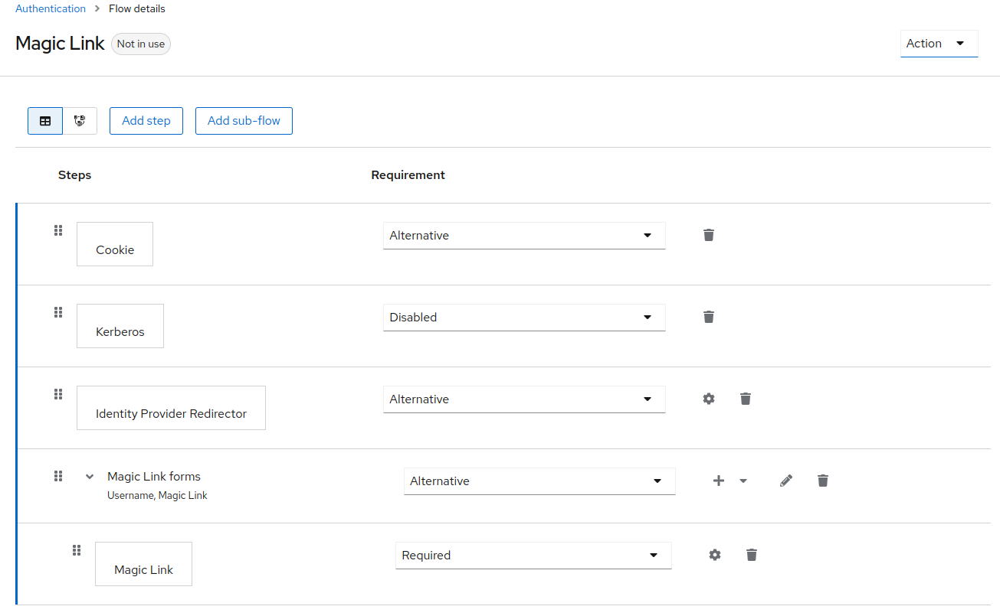
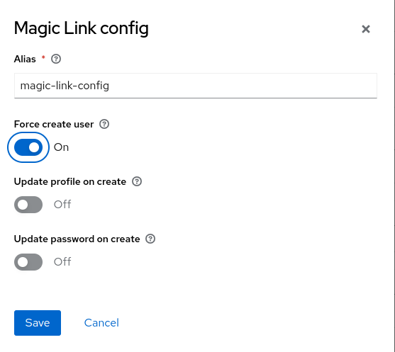
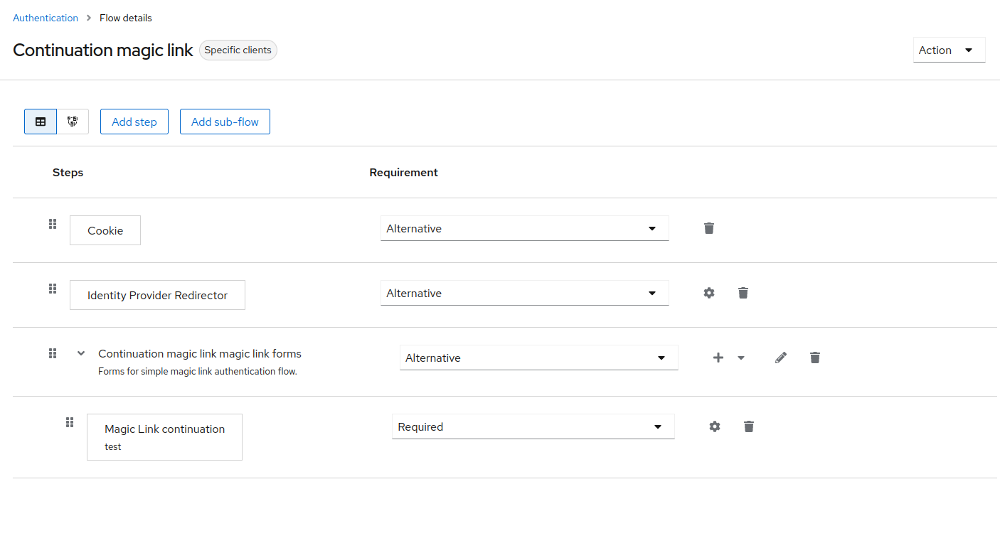
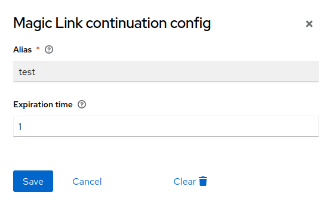
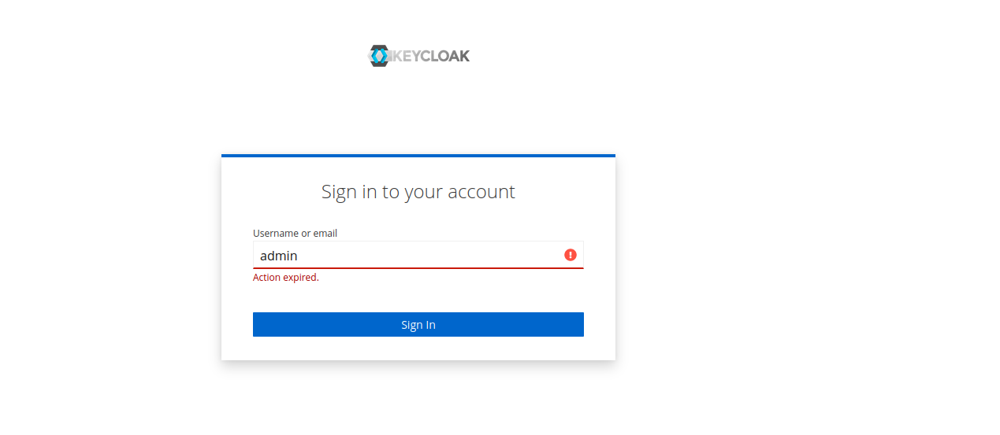
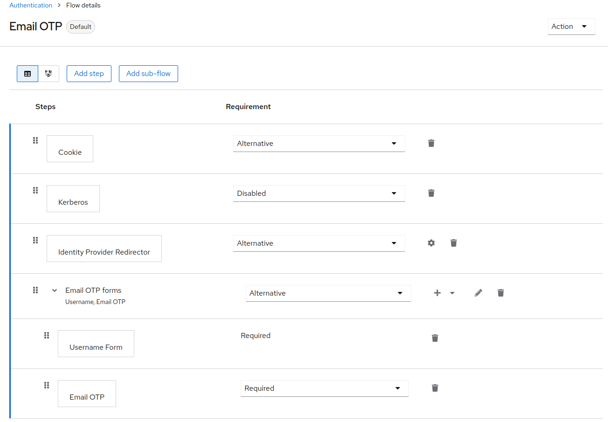

> :rocket: **Try it for free** in the new Phase Two [keycloak managed service](https://phasetwo.io/?utm_source=github&utm_medium=readme&utm_campaign=keycloak-magic-link). See the [announcement and demo video](https://phasetwo.io/blog/self-service/) for more information.

# keycloak-magic-link

Magic link implementation. Inspired by the [experiment](https://github.com/stianst/keycloak-experimental/tree/main/magic-link) by [@stianst](https://github.com/stianst).
It comes in two types: magic link and magic link continuation;

There is also a simple Email OTP authenticator implementation here.
This extension is used in the [Phase Two](https://phasetwo.io) cloud offering, and is released here as part of its commitment to making its [core extensions](https://phasetwo.io/docs/introduction/open-source) open source. Please consult the [license](COPYING) for information regarding use.

## Quick start

The easiest way to get started is our [Docker image](https://quay.io/repository/phasetwo/phasetwo-keycloak?tab=tags). Documentation and examples for using it are in the [phasetwo-containers](https://github.com/p2-inc/phasetwo-containers) repo. The most recent version of this extension is included.

## Magic link

This implementation differs from the original in that it creates an ActionToken that is sent as the link. This is convenient, as it does not require the user to click on the link from the same device. A common use case we heard was users entering their email address on the desktop, but then clicking on the link on their mobile, so we wanted to solve for that case.

This contains two pathways to get a Magic Link:

### Authenticator

An Authenticator that can run as a form in your login flow. This takes an email, and can optionally create a user if none exists. This implementation sends the email using a theme-resources template, which you can override. Installation can be achieved by duplicating the Browser flow, and replacing the normal Username/Password/OTP forms with the Magic Link execution type ([@tstec-polypoly](https://github.com/tstec-polypoly) provides a great step-by-step guide for setting it up https://github.com/p2-inc/keycloak-magic-link/issues/6#issuecomment-1230675741). Note that you aren't required to use a _Username form_ with this, as it extends `UsernamePasswordForm` and renders the username form page for you:



The authenticator can be configured to create a user with the given email address as username/email if none exists. It is also possible to force `UPDATE_PROFILE` and `UPDATE_PASSWORD` required actions when the user is created by this Authenticator:



## Magic link continuation

This Magic link continuation authenticator is similar to the Magic Link authenticator in implementation, but has a different behavior. Instead of creating a session on the device where the link is clicked, the flow continues the login on the initial login page. The login page is polling the authentication page each 5 seconds until the session is confirmed or the authentication flow expires. The default expiration for the Magic link continuation flow is 10 minutes.

### Authenticator



The authenticator can be configured to set the expiration of the authentication flow.



When the period is exceeded the authentication flow will reset.



### Keycloakify Theme Templates

If you are using Keycloakify and need the templates, you can find them in our Keycloakify Starter [fork](https://github.com/p2-inc/keycloakify-starter/tree/p2/magic-link-extension-templates) (go into the [pages](https://github.com/p2-inc/keycloakify-starter/tree/p2/magic-link-extension-templates/src/login/pages) folder).

### Resource

A Resource you can call with `manage-users` role, which allows you to specify the email, clientId, redirectUri, tokenExpiry and optionally if the email is sent, or the link is just returned to the caller.

Resources created with this API method return a URL that uses an Action Token. This will log a user in directly and skip any Authentication Flows defined.

Parameters:
| Name | Required | Default | Description |
| ----- | ----- | ----- | ----- |
| `email` | Y | | Email address associated with the User to create the magic link for. |
| `username` | N | | Username of the User to create the magic link for. Ignores email and forces `force_create`, `update_profile`, `update_password` and `send_email` to `false` if set. |
| `client_id` | Y | | Client ID the user will be logging in to. |
| `redirect_uri` | Y | | Redirect URI. Must be valid for the given client. |
| `expiration_seconds` | N | 86400 (1 day) | Amount of time the magic link is valid. |
| `force_create` | N | false | Create a user with this email address as username/email if none exists. |
| `update_profile` | N | false | Add an UPDATE_PROFILE required action if the user was created. |
| `update_password` | N | false | Add an UPDATE_PASSWORD required action if the user was created. |
| `send_email` | N | false | Send the magic link email using the built in template. |
| `scope` | N | | OIDC `scope` variable. |
| `nonce` | N | | OIDC `nonce` variable. |
| `state` | N | | OIDC `state` variable. |
| `code_challenge` | N | | OIDC `code_challenge` variable (for PKCE). |
| `remember_me` | N | false | If the user is treated as if they had checked "Remember Me" on login. Requires that it is enabled in the Realm. |
| `reusable` | N | true | If the token can be reused multiple times during its validity |
| `response_mode` | N | query | Determines how the authorization response is returned to the client: in the URL query string (query) or in the URL fragment (fragment). |

Sample request (replace your access token):

```
curl --request POST https://keycloak.host/auth/realms/test/magic-link \
 --header "Accept: application/json" \
 --header "Content-Type: application/json" \
 --header "Authorization: Bearer <access_token>" \
 --data '{"email":"foo@foo.com","client_id":"account-console","redirect_uri":"https://keycloak.host/auth/realms/test/account/","expiration_seconds":3600,"force_create":true,"update_profile":true,"update_password":true,"send_email":false}'
```

Sample response:

```
{
  "user_id": "386edecf-3e43-41fd-886c-c674eea41034",
  "link": "https://keycloak.host/auth/realms/test/login-actions/action-token?key=eyJhbG...KWuDyE&client_id=account-console",
  "sent": false
}
```

---

## Login Token

Login Token is a drop-in parallel implementation that can be deployed alongside the existing Magic Link without any breaking changes or flow migration.

### Why Login Token?

The original Magic Link authenticates the user *directly* via the action-token handler, bypassing the standard Keycloak browser flow entirely. This means:

- `acr_values` / step-up authentication cannot be evaluated natively.
- Subsequent authenticators (e.g. TOTP for LOA=2) cannot run in the same browser session.

Login Token solves this by returning a **login token** instead of an action-token URL. The credential is stored server-side in Infinispan; only a short UUID reference (`lt:{uuid}`) is returned in `login_hint`. The standard browser flow runs in full — `acr_values`, `Condition – Level of Authentication`, and all step-up logic work natively.

### How it works

```
POST /realms/{realm}/login-token
  → credential data (userId, clientId, expiry, optional LOA/rememberMe)
    stored in Infinispan under key "lt:data:{uuid}" with the requested TTL
  → returns: { "login_hint": "lt:{uuid}" }

Caller constructs the OIDC authorization URL and opens it in the browser:
  https://keycloak.host/realms/{realm}/protocol/openid-connect/auth
    ?client_id=myapp
    &response_type=code
    &login_hint=lt:{uuid}       ← returned login_hint passed verbatim
    &prompt=login               ← required (see note below)
    &redirect_uri=...           ← caller's redirect URI
    &code_challenge=...         ← caller's PKCE challenge
    &state=...                  ← caller's state
    [+ any other OIDC params]

  → standard OIDC browser flow starts
  → Login Token Verifier (login-token-verifier) resolves the credential:
      1. Strips "lt:" prefix from login_hint to get the UUID
      2. Looks up credential data in Infinispan by "lt:data:{uuid}"
      3. Checks expiry (TTL-enforced by Infinispan + explicit timestamp check)
      4. Verifies stored clientId matches the current OIDC client
      5. Enforces single-use via putIfAbsent("lt:used:{uuid}", ttl)
         (unless reusable=true)
      6. Sets user, optional LOA, optional remember-me
      7. context.success() → flow continues normally
  → Any subsequent step-up authenticators run in the same browser session
```

> **`prompt=login` is required.** Without it, Keycloak may find an existing session cookie before
> the Login Token Verifier runs and pre-populate the auth session with the cookie user.
> This causes an `already authenticated as different user` error when the Verifier later tries
> to authenticate the login token target user.

> **Why UUID instead of a signed JWT?**  Keycloak silently ignores OIDC parameters longer than
> 255 characters. A typical HS512/RS256 JWT is 500–700 characters and would be dropped, causing
> authentication to fail silently. The UUID reference (`lt:{uuid}`) is ~42 characters.
> Security is equivalent to v1 action tokens: 128-bit random UUID entropy + Infinispan TTL +
> atomic single-use tracking.

### REST API — `/login-token`

Requires `manage-users` role (same as `/magic-link`).

**Parameters:**

| Name | Required | Default | Description |
| ----- | ----- | ----- | ----- |
| `user_id` | Y* | | Keycloak user ID. Takes precedence over `email` and `username` when provided. `force_create` is ignored. |
| `email` | Y* | | Email address of the user. Mutually exclusive with `username`. |
| `username` | Y* | | Username of the user. When provided, `force_create` is ignored. |
| `client_id` | Y | | Client ID validated when the login token is redeemed. The verifier rejects redemption attempts from any other client. |
| `expiration_seconds` | N | 300 (5 min) | Token validity in seconds. |
| `loa` | N | | Force the session to this LOA level, overriding the flow's Condition configuration. |
| `remember_me` | N | false | Set the remember-me flag on the session. |
| `force_create` | N | false | Create the user if they do not exist (email only). |
| `reusable` | N | true | Allow the token to be used more than once within its validity window. |
| `set_email_verified` | N | false | When `true`, marks the user's email as verified after the token is successfully validated. |
| `confirm_user_switch` | N | false | Controls behaviour when a different user is already logged in on the device. When `false` (default), the existing session is silently logged out and the login token is processed automatically. When `true`, a confirmation screen is shown asking the user to approve the logout before continuing. |

*One of `user_id`, `email`, or `username` is required. `user_id` takes precedence if multiple are provided.

> **Important: place the Login Token Verifier before the Cookie authenticator in your flow.**
> Keycloak evaluates ALTERNATIVE executions in order and stops at the first success. If Cookie
> runs before the Verifier and an active session exists, Keycloak silently returns that session's
> token — even if it belongs to a different user than the one in the login token. Placing the
> Verifier first ensures it always gets to evaluate `login_hint` before Cookie can short-circuit
> the flow:
>
> ```
> Browser Flow
> ├── Login Token Verifier  [ALTERNATIVE]  ← must be first
> ├── Cookie                [ALTERNATIVE]
> ├── Kerberos              [ALTERNATIVE]
> └── Username/Password     [ALTERNATIVE]
> ```

**Sample request:**

```
curl --request POST https://keycloak.host/realms/test/login-token \
 --header "Accept: application/json" \
 --header "Content-Type: application/json" \
 --header "Authorization: Bearer <access_token>" \
 --data '{
   "email": "foo@example.com",
   "client_id": "myapp",
   "expiration_seconds": 300
 }'
```

**Sample response:**

```json
{
  "login_hint": "lt:5713e2a7-53a6-4fbc-8ff5-53d5d8862418"
}
```

The caller then constructs the OIDC authorization URL using the returned `login_hint` and opens it in the browser (or sends it to the user by email/SMS):

```
https://keycloak.host/realms/test/protocol/openid-connect/auth
  ?client_id=myapp
  &response_type=code
  &login_hint=lt:5713e2a7-53a6-4fbc-8ff5-53d5d8862418
  &prompt=login
  &redirect_uri=https://myapp.example.com/callback
  &scope=openid profile
  &state=abc123
  &nonce=xyz789
  &code_challenge=<S256-challenge>
  &code_challenge_method=S256
```

The caller is fully responsible for PKCE (`code_challenge`, `code_challenge_method`, `code_verifier`), `state`, `nonce`, `redirect_uri`, and `scope`. This design ensures that the entity generating the PKCE `code_verifier` is always the same entity that handles the authorization code callback — regardless of whether the link is opened on the same device or clicked on a different device (e.g. from an email).

### User-switch behaviour

When a login token is opened for User B while User A is already logged in on the same device, the verifier detects the session conflict and handles it based on the `confirm_user_switch` parameter:

**Default (`confirm_user_switch: false`) — automatic logout:**
The existing session cookies are silently expired and the browser is redirected to a fresh OIDC authorization request. The login token is still valid (single-use mark is not set until authentication completes), so the fresh flow picks it up and logs User B in transparently — no screen is shown.

**`confirm_user_switch: true` — confirmation screen:**
A confirmation page is shown informing the user that they are currently signed in on this device and asking whether they want to continue. Two options are presented:
- **Sign out and continue** — performs the same automatic logout and redirect as the default behaviour.
- **Cancel** — aborts the flow and redirects back to the client with `error=access_denied`.

---

## Email OTP

There is a simple authenticator to email a 6-digit OTP to the users email address. This implementation sends the email using a theme-resources template, which you can override. It is recommended to use this in an Authentication flow following the _Username form_. An example flow looks like this:


## Installation

1. Build the jar:

```
mvn clean install
```

2. Copy the jar produced in `target/` to your `providers` directory (for Quarkus) or `standalone/deployments` directory (for legacy) and rebuild/restart keycloak.

## Releases

Releases are tagged and published to [Maven Central](https://repo1.maven.org/maven2/io/phasetwo/keycloak/keycloak-magic-link/) after each merge to `main`. Jars can be downloaded from there.

If you are depending on the library in your own Maven-built project, or using a bundling tool in Maven, you can add the dependency like this:

```xml
    <dependency>
      <groupId>io.phasetwo.keycloak</groupId>
      <artifactId>keycloak-magic-link</artifactId>
      <version>VERSION</version>
    </dependency>
```

## Implementation Notes

This is a rough outline of the implementation:

- Given an email address
  - see if the email is already associated with a user
    - if yes, use that one
    - if not, create a user (this is configurable)
  - check to see if the redirectUri is valid for the client
    - if yes, continue
    - if not, throw an error
  - create an action token that encodes the user, expiry, clientId and redirectUri
  - action token handler needs to
    - invalidate the action token after single use
    - set the redirectUri
    - make sure to continue the login session after the handler

## Demo

User contributed POC using Jupyter: https://github.com/tstec-polypoly/explore-keycloak

---

All documentation, source code and other files in this repository are Copyright 2024 Phase Two, Inc.
