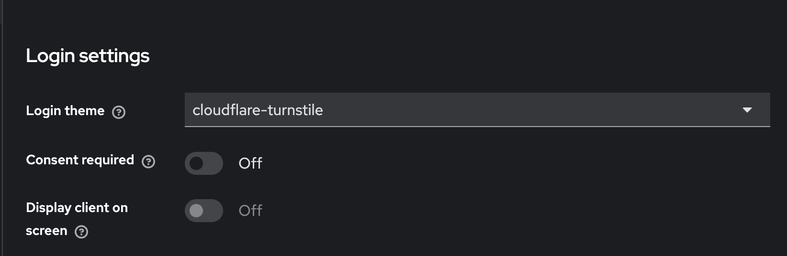
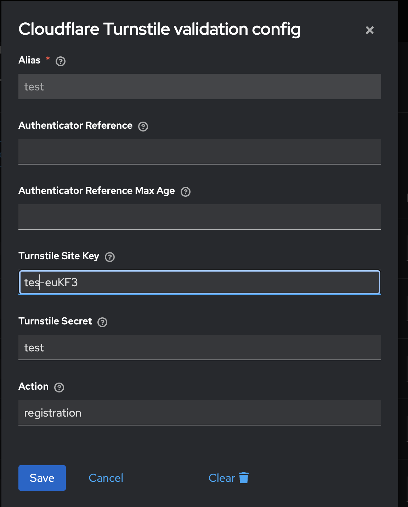
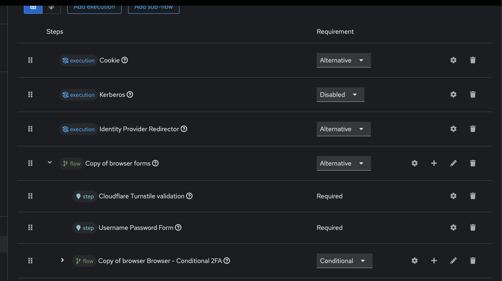
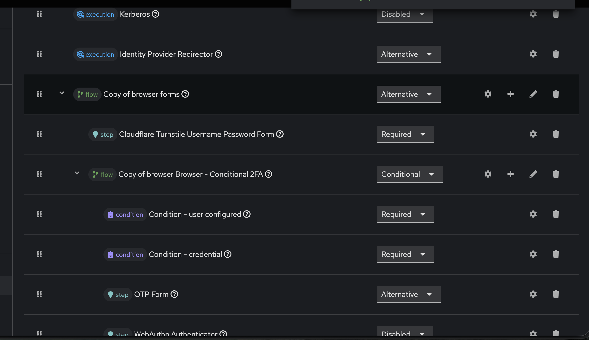
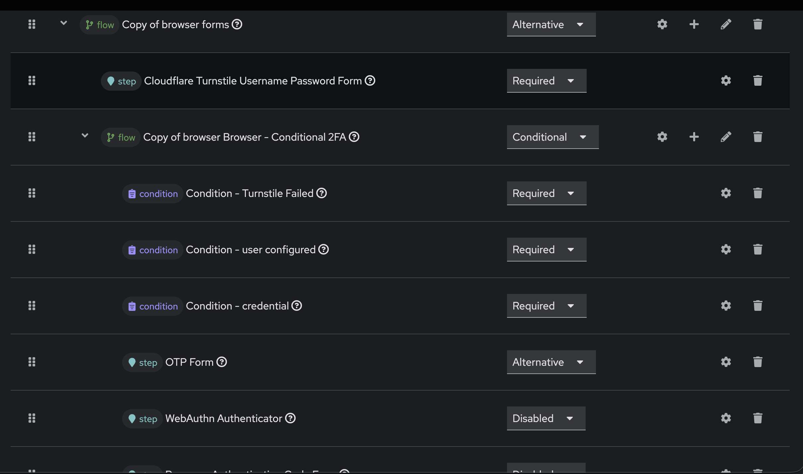
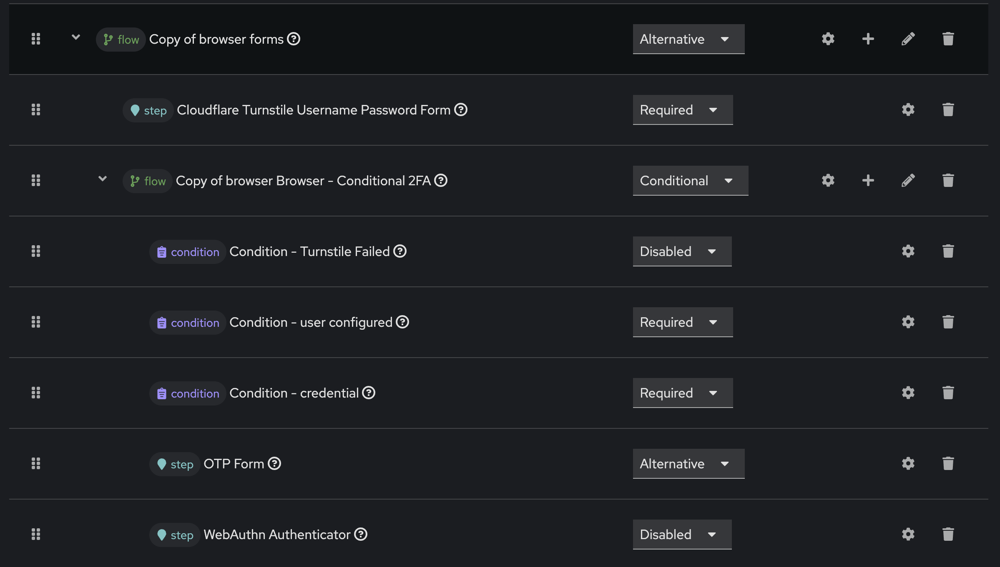
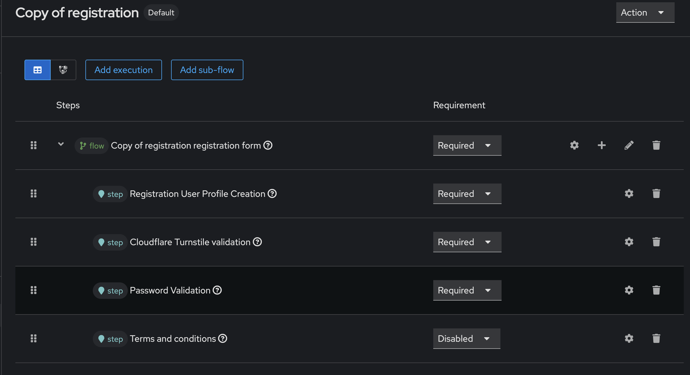

> :rocket: **Try it for free** in the new Phase Two [keycloak managed service](https://phasetwo.io/?utm_source=github&utm_medium=readme&utm_campaign=keycloak-magic-link). See the [announcement and demo video](https://phasetwo.io/blog/self-service/) for more information.

# keycloak-magic-link

Magic link implementation. Inspired by the [experiment](https://github.com/stianst/keycloak-experimental/tree/main/magic-link) by [@stianst](https://github.com/stianst).
It comes in two types: magic link and magic link continuation;

There is also a simple Email OTP authenticator implementation here.
This extension is used in the [Phase Two](https://phasetwo.io) cloud offering, and is released here as part of its commitment to making its [core extensions](https://phasetwo.io/docs/introduction/open-source) open source. Please consult the [license](COPYING) for information regarding use.

## Quick start

The easiest way to get started is our [Docker image](https://quay.io/repository/phasetwo/phasetwo-keycloak?tab=tags). Documentation and examples for using it are in the [phasetwo-containers](https://github.com/p2-inc/phasetwo-containers) repo. The most recent version of this extension is included.

## Magic link

This implementation differs from the original in that it creates an ActionToken that is sent as the link. This is convenient, as it does not require the user to click on the link from the same device. A common use case we heard was users entering their email address on the desktop, but then clicking on the link on their mobile, so we wanted to solve for that case.

This contains two pathways to get a Magic Link:

### Authenticator

An Authenticator that can run as a form in your login flow. This takes an email, and can optionally create a user if none exists. This implementation sends the email using a theme-resources template, which you can override. Installation can be achieved by duplicating the Browser flow, and replacing the normal Username/Password/OTP forms with the Magic Link execution type ([@tstec-polypoly](https://github.com/tstec-polypoly) provides a great step-by-step guide for setting it up https://github.com/p2-inc/keycloak-magic-link/issues/6#issuecomment-1230675741). Note that you aren't required to use a _Username form_ with this, as it extends `UsernamePasswordForm` and renders the username form page for you:


The authenticator can be configured to create a user with the given email address as username/email if none exists. It is also possible to force `UPDATE_PROFILE` and `UPDATE_PASSWORD` required actions when the user is created by this Authenticator:


## Magic link continuation

This Magic link continuation authenticator is similar to the Magic Link authenticator in implementation, but has a different behavior. Instead of creating a session on the device where the link is clicked, the flow continues the login on the initial login page. The login page is polling the authentication page each 5 seconds until the session is confirmed or the authentication flow expires. The default expiration for the Magic link continuation flow is 10 minutes.

### Authenticator


The authenticator can be configured to set the expiration of the authentication flow.


When the period is exceeded the authentication flow will reset.


### Keycloakify Theme Templates

If you are using Keycloakify and need the templates, you can find them in our Keycloakify Starter [fork](https://github.com/p2-inc/keycloakify-starter/tree/p2/magic-link-extension-templates) (go into the [pages](https://github.com/p2-inc/keycloakify-starter/tree/p2/magic-link-extension-templates/src/login/pages) folder). 

### Resource

A Resource you can call with `manage-users` role, which allows you to specify the email, clientId, redirectUri, tokenExpiry and optionally if the email is sent, or the link is just returned to the caller.

Resources created with this API method return a URL that uses an Action Token. This will log a user in directly and skip any Authentication Flows defined. 

Parameters:
| Name | Required | Default | Description |
| ----- | ----- | ----- | ----- |
| `email` | Y | | Email address associated with the User to create the magic link for. |
| `username` | N | | Username of the User to create the magic link for. Ignores email and forces `force_create`, `update_profile`, `update_password` and `send_email` to `false` if set. |
| `client_id` | Y | | Client ID the user will be logging in to. |
| `redirect_uri` | Y | | Redirect URI. Must be valid for the given client. |
| `expiration_seconds` | N | 86400 (1 day) | Amount of time the magic link is valid. |
| `force_create` | N | false | Create a user with this email address as username/email if none exists. |
| `update_profile` | N | false | Add an UPDATE_PROFILE required action if the user was created. |
| `update_password` | N | false | Add an UPDATE_PASSWORD required action if the user was created. |
| `send_email` | N | false | Send the magic link email using the built in template. |
| `scope` | N | | OIDC `scope` variable. |
| `nonce` | N | | OIDC `nonce` variable. |
| `state` | N | | OIDC `state` variable. |
| `code_challenge` | N | | OIDC `code_challenge` variable (for PKCE). |
| `remember_me` | N | false | If the user is treated as if they had checked "Remember Me" on login. Requires that it is enabled in the Realm. |
| `reusable` | N | true | If the token can be reused multiple times during its validity |
| `response_mode` | N | query | Determines how the authorization response is returned to the client: in the URL query string (query) or in the URL fragment (fragment). |

Sample request (replace your access token):

```
curl --request POST https://keycloak.host/auth/realms/test/magic-link \
 --header "Accept: application/json" \
 --header "Content-Type: application/json" \
 --header "Authorization: Bearer <access_token>" \
 --data '{"email":"foo@foo.com","client_id":"account-console","redirect_uri":"https://keycloak.host/auth/realms/test/account/","expiration_seconds":3600,"force_create":true,"update_profile":true,"update_password":true,"send_email":false}'
```

Sample response:

```
{
  "user_id": "386edecf-3e43-41fd-886c-c674eea41034",
  "link": "https://keycloak.host/auth/realms/test/login-actions/action-token?key=eyJhbG...KWuDyE&client_id=account-console",
  "sent": false
}
```

## Email OTP

There is a simple authenticator to email a 6-digit OTP to the users email address. This implementation sends the email using a theme-resources template, which you can override. It is recommended to use this in an Authentication flow following the _Username form_. An example flow looks like this:


## Cloudflare Turnstile CAPTCHA

There are three [Cloudflare Turnstile](https://www.cloudflare.com/application-services/products/turnstile/) integrations available, each suited for a different flow type. All three share the same configuration — you will need a Cloudflare account with a Turnstile widget set up to obtain a **Site Key**, **Secret**, and **Action** value.

Before using any of them:

- Go to **Realm Settings → Security Defenses → Content-Security-Policy** and add `https://challenges.cloudflare.com` to the `frame-src` directive (space-separated list) so Keycloak can load the Turnstile widget.
- Set the login theme to `cloudflare-turnstile`. This can be applied to the entire realm under **Realm Settings → Themes → Login theme**, or to a specific client under the client's **Settings → Login settings → Login theme**.



All three share the same configuration dialog — enter your **Turnstile Site Key**, **Turnstile Secret**, and **Action** from your Cloudflare dashboard:



### Cloudflare Turnstile Validation (standalone)

**Display name:** `Cloudflare Turnstile validation`

A standalone authenticator step that presents a dedicated Turnstile challenge page to the user. This is the most flexible option — it can be placed before any step in a login flow that needs bot protection (e.g., before Magic Link or Email OTP). It does not require the user to be identified beforehand.

**When to use:** Add it as a step in your browser flow immediately before any authenticator you want to protect, such as the Magic Link authenticator.



### Cloudflare Turnstile Username Password Form

**Display name:** `Cloudflare Turnstile Username Password Form`

A drop-in replacement for Keycloak's standard **Username Password Form** step. It embeds the Turnstile widget directly into the login page alongside the username and password fields, so users complete the CAPTCHA as part of signing in rather than on a separate page.

If the Turnstile check fails but the user provides valid credentials, the authenticator can optionally flag the account for email verification before the session is granted. This is controlled by the **Verify email on CAPTCHA failure** configuration option, which is **disabled by default**. When enabled, it acts as a rudimentary MFA fallback for environments that do not support full 2FA flows — legitimate users are not hard-blocked but must verify their email, raising friction for bots.

> **Note:** If the authenticator configuration is missing or incomplete (no Site Key, Secret, or Action set), it falls back to behaving exactly like the standard Keycloak Username Password Form — no CAPTCHA is shown and login proceeds normally.

**When to use:** Replace the standard `Username Password Form` execution in a browser flow when you want Turnstile protection on the login page itself without adding a separate step.



#### Use case: CAPTCHA-gated 2FA

A powerful pattern enabled by combining this authenticator with the **Condition - Turnstile Failed** conditional authenticator is CAPTCHA-controlled 2FA enforcement. The idea is to place a conditional subflow after the login step that contains your 2FA executions (OTP, WebAuthn, etc.) and use the two conditions below to decide when it runs.

**2FA triggered by Turnstile failure**

Add `Condition - Turnstile Failed` as **Required** inside the conditional subflow. The 2FA challenge is only presented to users for whom the CAPTCHA failed — suspected bots or automated submissions — while normal users who pass the widget proceed without any extra step.



**2FA based on user settings**

Set `Condition - Turnstile Failed` to **Disabled** and rely solely on `Condition - user configured` and `Condition - credential`. The 2FA subflow now runs for any user who has a second factor enrolled, regardless of the CAPTCHA result — the standard Keycloak 2FA behaviour.



By toggling the `Condition - Turnstile Failed` step between **Required** and **Disabled** you can switch the flow between bot-targeted 2FA and universal 2FA without restructuring the flow.

### Cloudflare Turnstile Validation (registration form action)

**Display name:** `Cloudflare Turnstile validation` (under form actions)

A form action designed specifically for the **Registration** flow. It adds the Turnstile widget to the registration form and validates the challenge when the user submits. The check is automatically skipped if the user is already identified (e.g., in an invite flow).

**When to use:** Add it as a form action inside the built-in Registration flow to prevent bots from bulk-creating accounts through self-registration.



## Installation

1. Build the jar:

```
mvn clean install
```

2. Copy the jar produced in `target/` to your `providers` directory (for Quarkus) or `standalone/deployments` directory (for legacy) and rebuild/restart keycloak.

## Releases

Releases are tagged and published to [Maven Central](https://repo1.maven.org/maven2/io/phasetwo/keycloak/keycloak-magic-link/) after each merge to `main`. Jars can be downloaded from there.

If you are depending on the library in your own Maven-built project, or using a bundling tool in Maven, you can add the dependency like this:

```xml
    <dependency>
      <groupId>io.phasetwo.keycloak</groupId>
      <artifactId>keycloak-magic-link</artifactId>
      <version>VERSION</version>
    </dependency>
```

## Implementation Notes

This is a rough outline of the implementation:

- Given an email address
  - see if the email is already associated with a user
    - if yes, use that one
    - if not, create a user (this is configurable)
  - check to see if the redirectUri is valid for the client
    - if yes, continue
    - if not, throw an error
  - create an action token that encodes the user, expiry, clientId and redirectUri
  - action token handler needs to
    - invalidate the action token after single use
    - set the redirectUri
    - make sure to continue the login session after the handler

## Demo

User contributed POC using Jupyter: https://github.com/tstec-polypoly/explore-keycloak

---

All documentation, source code and other files in this repository are Copyright 2024 Phase Two, Inc.
